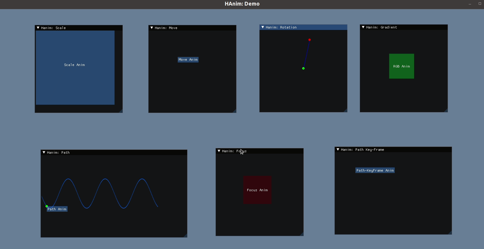

# HAnim (Hi Animation / Hello Animation)

HAnim是一个**帧驱动**, **跨平台**且**动画行为与动画对象分离**的动画框架.

[核心设计思想:](docs/design-thinking.md) **Animation =  HEngine(HAnimate, HObject)**


## 特性/功能

- **帧驱动**模型, 即适用与**保留模式**GUI库(Qt/其他)也适用于**立即模式**图形/GUI库(opengl/imgui等)
- **动画行为** 与 **动画对象** 解耦, 实现分离设计与开发, 从而提高 设计效率与**复用**可能性

- 支持对象无关的**基础动画**与**组合动画**设计
- 支持作为动画库的框架使用, 也可作为一个**动画中间件**嵌入到一个应用或库
- Header-Only库(需C++ >= 17)


## 示例/Demo

### imgui - 立即模式GUI库




---


## 使用方法

### HObject临时对象 - 立即模式 - imgui

```cpp
    auto gMove = hanim::move(100, 50, 100, 200);

    while (!glfwWindowShouldClose(window)) {
        // ...

        ImGui::Begin("Hanim: Move");
        hanim::HEngine::PlayFrame(gMove, hanim::HObject(
            [ & ](int type, const hanim::IAFrame &frame) {
                switch (type) {
                    case hanim::InterpolationAnim::MOVE:
                        ImGui::SetCursorPosX({ frame.data[0] });
                        ImGui::SetCursorPosY({ frame.data[1] });
                        break;
                    default:
                        break;
                }
                ImGui::Button("Move Anim");
            }
        ));
        ImGui::End();

        // ...
    }
```

### HObject对象 - 立即模式 - opengl

```cpp
    // hanim1: create animate
    auto button = hanim::object::opengl::Button();
    auto gMove = hanim::move(100, 50, 100, 200);
    gMove.start();

    while (!glfwWindowShouldClose(window)) {
        //...
        // hanim2: exec animate
        hanim::HEngine::PlayFrame(gMove, button);

        //...
    }
```

### HObject对象 - 保留模式 - qt

```cpp
    hanim::object::qt::Button button("move", &window);
    auto gMove = hanim::move(100, 50, 100, 200);
    hanim::HEngine::Play(gMove, button);
```


## Other

- [HAnim](https://github.com/Sunrisepeak/HAnim)
- [Github](https://github.com/Sunrisepeak)